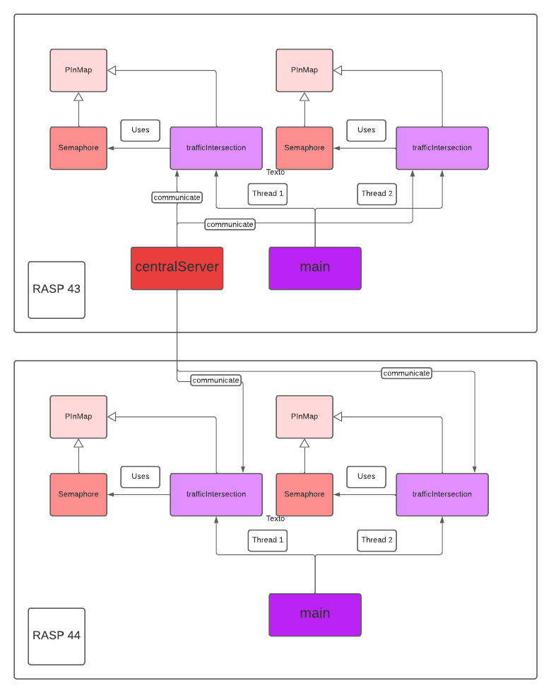

# Trabalho 1 (2022-1)

Trabalho 1 da disciplina de Fundamentos de Sistemas Embarcados (2022/1)
Realizado por Ariel Vieira Lima Serafim.

## 1. Como rodar o projeto:

- 1: adicione a pasta assignment 1 à coneção ssh da rasp 43.
- 2: na pasta assignment 1 use 'make all'
- 3: na pasta server use 'g++ centralServer.cpp -o server -pthread'
- 4: adicione a pasta assignment 1 à coneção ssh da rasp 44.
- 5: na pasta assignment 1 use 'make all'
- 6: na pasta server da rasp 43, use ./server
- 7: na pasta assignment 1 da rasp 43 use ./trafficIntersection
- 7: na pasta assignment 1 da rasp 44 use ./trafficIntersection 

## 2. Estrutura do projeto

## 3. Referências:
- Raspberry Pi Advanced Guide (https://www.youtube.com/watch?v=gymfmJIrc3g&t=259s)
- Threads in c++ (https://www.youtube.com/watch?v=wXBcwHwIt_I&t=372s)
- Exemplo TCP (https://gitlab.com/fse_fga/embarcados_exemplos_c/-/tree/master/sockets/sockets_tcp)

### Bibliotecas C/C++ Usadas

- WiringPi (http://wiringpi.com/)
- Thread (https://cplusplus.com/reference/thread/thread/)
- Sys/socket (https://pubs.opengroup.org/onlinepubs/7908799/xns/syssocket.h.html)
- Arpa/inet (https://pubs.opengroup.org/onlinepubs/7908799/xns/arpainet.h.html)
- Unistd (https://pubs.opengroup.org/onlinepubs/7908799/xsh/unistd.h.html)
- Chrono (https://cplusplus.com/reference/chrono/)